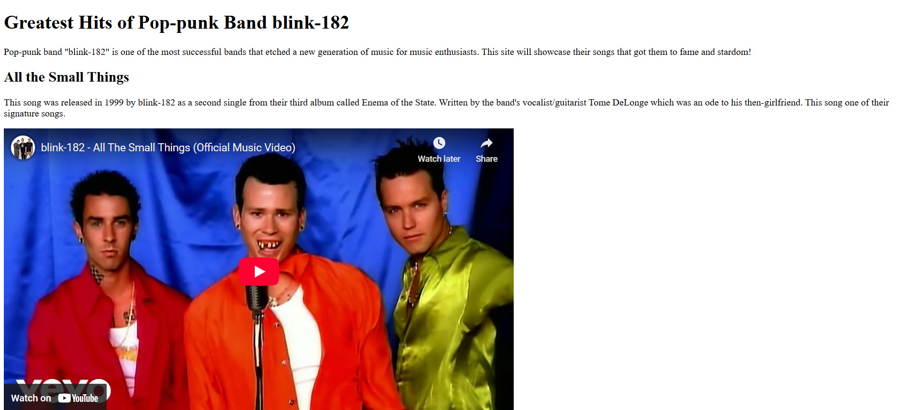

# 💻 Video Compilation Page

## ℹ️ A Video Compilation Tribute to blink-182's Greatest Hits

A **HTML-only video showcase** highlighting the most iconic music videos from the legendary pop-punk band **blink-182**. Created as part of the [freeCodeCamp.org](https://www.freecodecamp.org/learn/full-stack-developer/) HTML5 free course.

---

## 🔍 Overview

This simple site features embedded YouTube videos with context-rich descriptions about each track, designed to simulate a fan tribute page.

These videos are three standout songs from blink-182’s discography:  
**“All the Small Things”**, **“I Miss You”**, and **“What’s My Age Again?”**. It gives fans quick access to their official videos while delivering concise song histories and fun facts.

---

## ✨ Features

- Embedded YouTube videos using the `<iframe>` element
- Accessible text descriptions for each featured song
- Semantic HTML with `<main>`, `<section>`, and proper headings
- Meta and Open Graph tags for SEO and social preview optimization
- Mobile-friendly `<meta viewport>` for responsive scaling

---

## 🧠 What I Learned

- Embedding YouTube videos using iframes with proper attributes
- Structuring multi-section content cleanly with semantic HTML
- Enhancing shareability through OG meta tags
- Writing clear, engaging summaries for multimedia content

---

## 🛠️ Tech Used

- HTML5
- Git
- GitHub
- Netlify

---

## 🚀 How to Run

1. Clone the repository
2. Open `index.html` in your browser

---

## 🌐 Live Demo

Or you can check out the 👉 [live website here](https://video-compilation-page-fcc-jiro.netlify.app/)

---

## 🧑‍💻 Author

Created by **Elmar Chavez**

🗓️ Month/Year: **April 2025**

📚 Journey: **1st** month of learning _frontend web development_.
